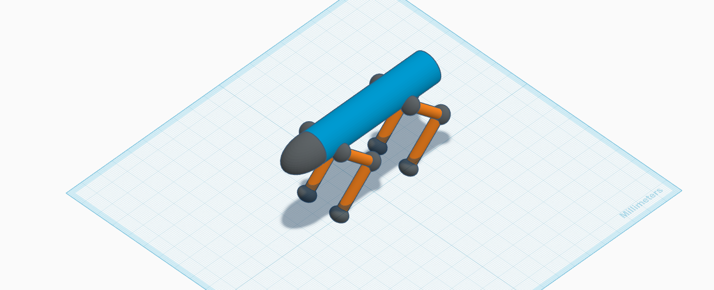

# 🤖 3D Robot-Dog Design Project

> 💡 **Tip:** Want to rotate and interact with the 3D model yourself? 
> 👉 **[Click here to open the Interactive 3D Viewer](./3d-models/Robot-Dog.stl)** and move the model with your mouse!
> [!CAUTION]
> *(Note: GitHub's built-in STL viewer renders models in grey by default. To view the original multi-color design, please refer to the Design Preview image below).*
> [!WARNING]
> GitHub's built-in STL viewer renders models in grey by default. To view the original multi-color design, please refer to the Design Preview image below.

## 📸 Design Preview

Below is a high-quality preview of the final 3D model after merging the shapes and enabling the **Multi-color** feature to preserve the original component colors:

  

---

## 📂 Quick Navigation Links

You can navigate directly through the project files and evaluation criteria using the quick links below:

* 📝 **[Click here to view the Assignment Solutions](./solutions/assignment-questions.md)**
* 🤖 **[Interactive 3D STL Model Viewer](./3d-models/Robot-Dog.stl)** *(Click to rotate and inspect the model live on GitHub)*

---

## 🛠️ Tools & Technologies Used

* **Tinkercad:** For 3D modeling, precise shaping, and symmetrical mirroring.
* **GitHub:** For hosting the repository, version control, and interactive 3D STL file rendering.
* **Markdown:** For creating clean, structured documentation.
